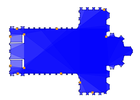
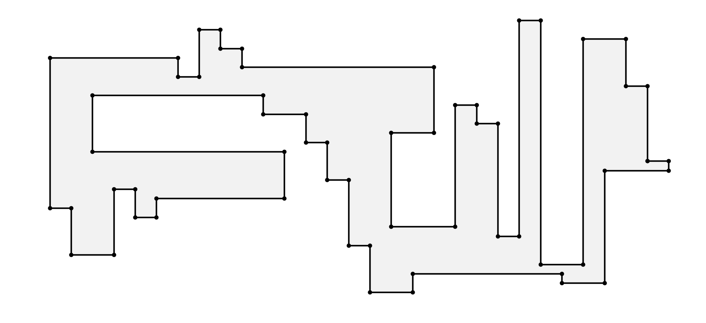
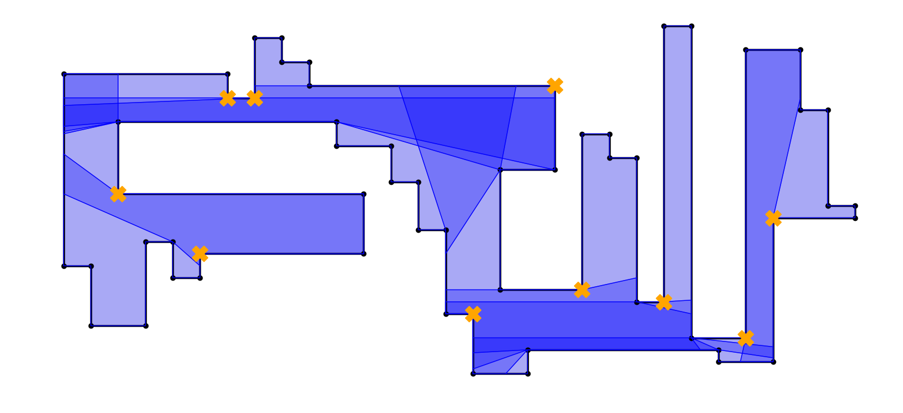

This is a C++ library to solve the art gallery problem, which is an NP-hard problem within the fields of
computational geometry and optimisation.

<p align="center">
  
</p>


## Problem formulation

We define the art gallery problem (AGP) as follows: _Given a gallery or a museum find the minimum number of guards/cameras to watch the interior of the gallery._

A gallery is represented as a simple polygon $P$ without holes and guards as a set of points of $P$. In this library we sovle the AGP for stationary guards that can be placed, both in the vertices of the polygon or in its interior.

<p align="center">
 <br>
An example of a gallery.
</p>

<p align="center">
 <br>
A solution for the given gallery.
</p>

* images were generated using the Python module provided in this repository.


## Algorithms

Following alogrithms are provided in the library:

 - An algorithm based on Fisk's proof [[1]](#1),
 - Ghosh's approximation algorithm [[2]](#2),
 - Couto el al. exact algorithm [[3]](#3),
 - Baumgartner et al. algorithm that solves the point AGP [[4]](#4).

First three algorithms solve the vertex problem (when the guards can be placed only in the vertices). Baumgartner's approach tries to solve the general AGP. All the algorithms take a vector of points representing a gallery and return a vector of guards.

## Modules

The library consists of four modules:

- algo - containing all the available algorithms,
- arrangement - a module to handle gallery shapes,
- cplex - a wrap for the CPLEX package,
- plot - a module to plot algorithms results.


## Build

Before building install prerequisites:
- CGAL 4.13,
- CPLEX for C++ 12.8.0,
- CMake.

The first step is to configure the CPLEX package. We must set evironment variables CPLEXDIR
(path to CPLEX Interactive Optimizer module) and CONCERTDIR (path to Concert Technology module). The paths may vary from
the code presented below.
```console
$ export CPLEXDIR=/opt/ibm/ILOG/CPLEX_Studio128/cplex
$ export CONCERTDIR=/opt/ibm/ILOG/CPLEX_Studio128/concert
```

The next step is to build the project using cmake. It is performed in the root directory of the project as follows:
```console
$ mkdir build && cd build
$ cmake ..
```

A file to show how to use the library is located in `src/client`. In order to execute it, run the following:
```console
$ make main
$ cd src/client
$ ./main
```

## Instances

Instances of polygons were taken from [here](www.ic.unicamp.br/∼cid/Problem-instances/Art-Gallery). Each file has specified
a number of vertices followed by the coordinates (x, y) of each point. The coordinates are
expressed as fractions. A file representing a square with side lengths equal to 4 could look as follows:
```
4 0/1 0/1 4/1 0/1 4/1 4/1 0/1 4/1
```
It is expected that the polygons are saved as sequences of vertices ordered counterclockwise, such that the interior of the
polygon is located on the left side. This assumption speeds up the performance of the algorithms.

## Documentation

To generate the documentation using doxygen run:
```console
$ doxygen Doxyfile 
```
Two documentation formats will be available: html and latex. Both formats are located in `documentation` directory. In order to view the html documentation, type `<path-to-repo>/documentation/html/index.html` in your browser.

## References
<a id="1">[1]</a>
Fisk, S. (1978). A short proof of chvátal’s watchman theorem. Journal of Combinatorial Theory, Series B, 24(3):374.

<a id="1">[2]</a>
Ghosh, S. K. (2010). Approximation algorithms for art gallery problems in polygons. Discrete Applied Mathematics, 158(6):718–722.

<a id="1">[3]</a>
Couto, M. C., de Rezende, P. J., & de Souza, C. C. (2011). An exact algorithm for minimizing vertex guards on art galleries. International Transactions in Operational Research, 18(4), 425-448.

<a id="1">[4]</a>
Kröller, A., Baumgartner, T., Fekete, S. P., & Schmidt, C. (2012). Exact solutions and bounds for general art gallery problems. Journal of Experimental Algorithmics (JEA), 17, 2-1.